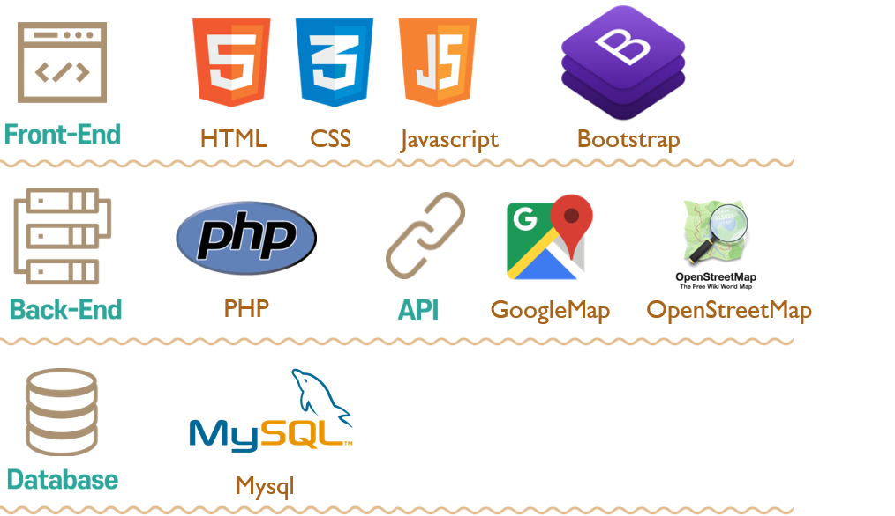
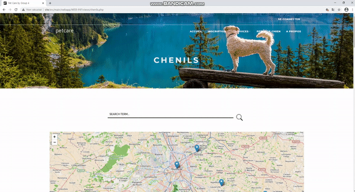
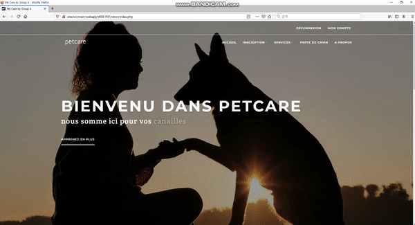
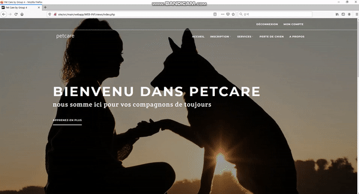
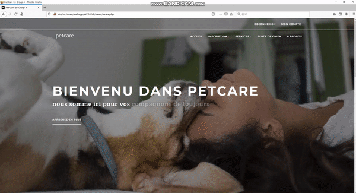

# ABOUT PROJECT
#### [ PetCare ] Développement Site Web : Recherche de chenils pour chien, Communication avec les gardiens particuliers, Déclaration de perte de chiens  *( 2020.09.16 ~ 2020.12.02 )*

## 1. Membres de l'équipe

|*Members*|*Contact*|
|:---:|---|
|**Joohyun ANN**| |
|**Maimouna Bah**| |
|**Cailler Dylan**| |

## 2. Installation du projet
1. Copier Code Github 
2. Connexion WampServer 
3. Import Projet
4. Connexion DB to Phpmyadmin
   1. Exécution SQL (db/petcare.sql)
   2. Adapation de connexionBD.php
      1. dbname
      2. username
      3. password
6. Exécution du WampServer
   
## 3. Présentation du projet
&nbsp; Ayant eu l'idée de réaliser un site web de style "Airbnb" pour hotel pour chien, nous avons réalisé le projet PETCARE accompagnement des apprentissages du premier semestre de M1 de MIAGE. 

> *"Affirme près de 25% de la population française. En effet, des statistiques montrent qu’un foyer sur deux possède un chien."* 

&nbsp; Nous avons donc décidé de réaliser un site web qui permet de **rechercher** les chenils dans la région, **devenir et contacter** les gardiens particuliers, ainsi que **déclarer** la perte de chiens.

## 4. Technologie 

# Results
## 1. Résultat
### *Main Page*
  

 
&nbsp;Présentation des trois services que l'on offre ; **Recherche de chenils**, **Contact des gardiens particuliers**, **Déclaration de perte de chien**

---

### *Chenils*

 
&nbsp; L'importation de API de **OpenStreetMap** permet de savoir où se trouve les chenils. Grâce aux bulle d'infos en **javascript**, les utilisateurs peuvent également savoir le nom de chenils lié. L'entrepôt de donnés possédent les chenils existant dans la région toulousaine. Selon les chenils, les informations sur le site ou leur contact sont mise à dispositin.  

1. L'image de chenils 
2. L'adresse locale du chenils 
3. L'URL de site web 
4. Le numéro de chenils  
5. L'adreesse mail de chenils  
  

### *Chenils Research*

 
&nbsp; La recherche se fait parmi les noms de chenils. Le mot en recherche n'a pas d'importance que ce soit en majuscule ou en miniscule.   

---

### *Log-in / Log-out*

 - **Se Connecter**

  
 &nbsp;L'inscription se fait avec l'adresse mail. Une fois se connectée, la déconnexion est demandée afin de se reconnecter.  
 &nbsp;Dès l'inscription, le mot de passe entré est crypté dans notre base de donnée afin de protéger les donnés personnelles des clients.  
 
---

### *Particuliers*

 
&nbsp;La liste de gardiens particuliers sont montrées. Il est possible de lui envoyer un message afin de comminiquer plus de besoins. Les informations de base sont déjà implanté grâce à Session. Le gardein particuliers auquel le message a été envoyé peut consulter les messages dans mon compte lors de sa connexion. 

---

### *My Page*

 
&nbsp;La page Mon Compte est différente selon le status du compte (Client ou Gardien). Cela est différencié dès l'inscription.
  - Client
  1. Consultation de son profil, modification
  2. Présentation
  3. Informations de son chien
  - Gardien
  1. Consultation de son profil, modification
  2. Présentation
  3. Les messages recus

---

### *Perte de chien*
&nbsp;Tous les utilisateurs peuvent consulter et déclarer la perte de chien.
1. Déclaration de perte de chien

## 2. Défis
 - **Base de données** : 
    &nbsp;La base de données devait au mieux représenter les informations par rapport au **besoin exprimé**, qui était donc de mettre en place un site fonctionnel et interactif entre les propriétaires de chiens et des gardiens, professionnels ou particuliers, ou d'autres propriétaires. Il a donc fallu **reflechir à la structure** de la Base de Données afin de pouvoir enregistrer chaque information nécessaire à **l'exploitation et le lien au site web.**
  En effet, ne connaissant que peu de langages de Bases de Données, nous avons tout d'abord dû décider duquel utiliser afin de faciliter au plus la connexion avec le Site web. Ayant choisi **MySQL Workbench**, nous nous sommes rapidement lancés dans sa création. Mysql est similaire à Oracle, mais le langage n'est pas pas exactement le même. La difficulté était donc d'adapter nos scripts dans le bon langage, par apprentissage numérique de ce dernier et de son environnement. En raison du manque de cours MySQL clairs, certains problèmes sont survenus pendant ce processus de conversion.  Par la suite, une **insertion de données** dans la BD était nécessaire par rapport aux informations qui devaient être présents sur le site, notamment ceux des chenils. Pour cela, nous avons utilisé l'outil "web scaper" pour obtenir des données. La plus part du temps, les bases de données n’était pas accessibles et il fallait passer par l’administrateur du site pour pouvoir récolter les données. Néanmoins, pour certains sites Web, ses sections sont reguliers, et l'acquisition de données est autorisé et facile. Cependant, certains sites Web ont des sections confus alors on ne peut pas utiliser le "web scraper" pour **obtenir automatiquement des données**. Cela nous oblige à les **compléter manuellement**, ce qui prend beaucoup de temps. Un autre problème rencontré était par rapport à **l'abondance et répétitions de donées** entre différents sites Web, Cela nous oblige à les trier et à les filtrer manuellement.  Finalement, par la mise en place d'un groupe interdisciplinaire et grâce à l’implication de chacun, nous avons réussi à mettre en place une base de données facile à gérer, favorisant la transparence et la qualité de l’information.  

    
- **Site Web** : 
    
    &nbsp;Notre objectif était de créer un site qui présente clairement les services que PETCARE propose (au niveau du Front-end). Il s'agissait de les faire fonctionner correctement dans le langage PHP & HTML, avec des outils comme **API OpenStreetMap, Bootstrap, Javascript, et JQuery (au niveau du back-end).** En ayant eu peu d'expérience dans la création de site web pour certains membres, il était donc nécessaire d'être avide de connaissances et d'appliquer les apprentissages des cours de Site Web et de Programmation Structurée.  En effet, en réalisant le projet, nous avons rencontré quelques difficultés, notamment par rapport à l'utilisation du langage PHP, qui était nouveau pour certains membres de l'équipe. Mais grâce à **la cohésion de l'équipe**, nous avons vite appris à l'utiliser et cette expérience nous a aidé à **avoir confiance dans l'apprentissage de nouvelles technologies.**  Cependant, certains services que l'on avait prévu d'intégrer ont dû être abandonnés par manque de temps. Par exemple, **la géolocalisation des utilisateurs** et la création de **l'espace Forum** n'ont pas pu être réalisés.  Enfin, **l'interdisciplinarité et le travail d'équipe** nous ont permis de créer un site fonctionnel et interactif qui comprend les fonctions essentielles.  
